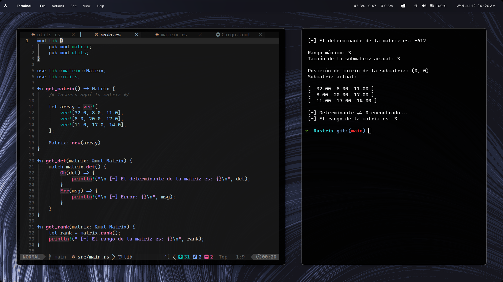

    

    <h1>Calculadora matricial</h1>

Esta calculadora fue creada en base a la necesidad de resolver las operaciones matriciales en una asignatura de Álgebra lineal. Se optó por el lenguaje de programación rust para aprender su estructura y fundamentos.

